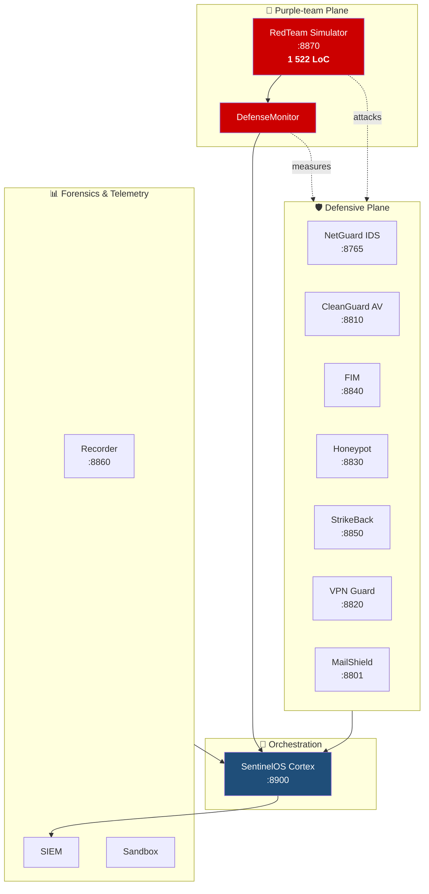
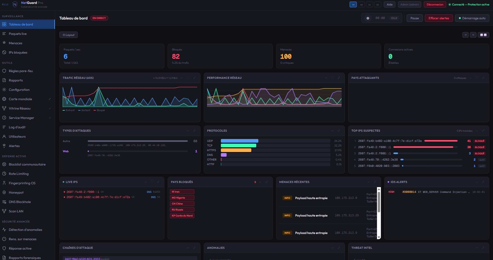
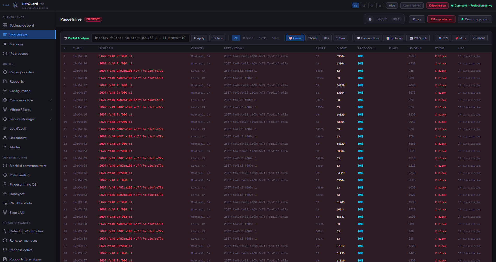
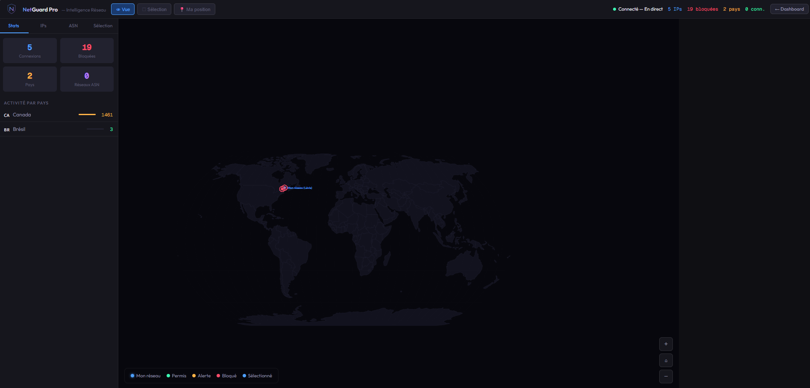
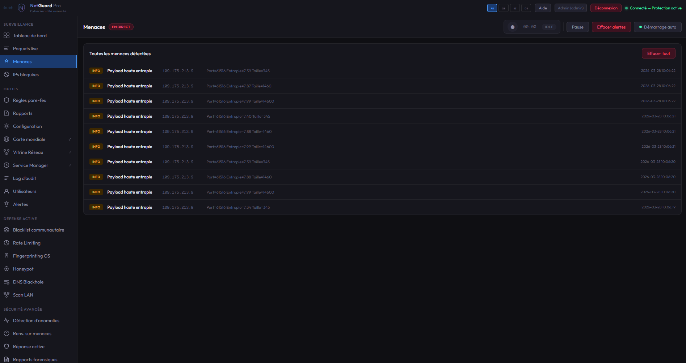

<div align="center">

# 🛡️ NetGuardPro Suite — Public Showcase

### 14-Program Cybersecurity Defense Platform with Integrated Red Team Simulator

[](#-license)
[](#-source-code--access)
[](#-the-14-programs)
[](#-red-team-simulator-the-headline-feature)
[](#-platforms)
[](#-author--contact)

*Protect. Detect. Respond. — and Attack Yourself to Verify the Defenses.*

</div>

---

## 📖 What is NetGuardPro

NetGuardPro Suite is a **defense-in-depth cybersecurity platform** that integrates 14 Python programs into a single ecosystem orchestrated by **SentinelOS Cortex** (a central event correlator on WebSocket port 8900). Every component runs independently or as part of a coordinated playbook — and one of those components is a built-in **Red Team Simulator** that *attacks the suite's own defensive agents* to measure detection rates in real time.

Think of it as a SOC-in-a-box where the blue team and the purple team ship in the same installer.

This repository is the **public showcase** — architecture, screenshots, design rationale, and license terms. The full source code lives in a separate private repository ; access is granted on request to evaluators, recruiters, and prospective customers.

---

## 🔴 Red Team Simulator (the headline feature)

**1 522 lines of Python** dedicated to simulating offensive security against the suite's own defensive components, with safety guarantees and built-in evaluation.

### Architecture

```
RedTeam Simulator (port 8870)
├── SafetyGuard          — restricts attacks to localhost / private IPs only
│                          + rate-limit 5 attacks/min/type
├── BaseAttack           — abstract base class for all simulators
├── PortScanSimulator    — TCP connect scan on 20 random ports
├── BruteForceSimulator  — rapid auth-port connections
├── SynFloodSimulator    — SYN flood (via scapy when available, fallback otherwise)
├── DNSTunnelSimulator   — high-entropy DNS queries to test DPI
├── HoneypotProber       — probe fake services on the localhost honeypot
├── DecoyTrigger         — trigger StrikeBack decoys
├── DPITrigger           — send DPI signature payloads (Snort-style rules)
├── FIMTamper            — create/modify test files for the FIM agent to detect
├── NetworkScanFlood     — ARP / ICMP scan burst
├── DefenseMonitor       — connect to defense agents & MEASURE detection rate
│                          (the control-evaluation harness)
├── AttackOrchestrator   — coordinate attacks & scenarios
└── WebSocket Server     — serves live state to Cortex / dashboard
```

### Pre-defined attack scenarios

| Scenario | Attacks chained | Use case |
|---|---|---|
| `script_kiddie` | port_scan → brute_force | Baseline noise. Should be detected by every IDS. |
| `apt_simulation` | port_scan → dns_tunnel → dpi_trigger → fim_tamper → honeypot_prober | Stealthy lateral movement. Tests DPI + FIM + honeypot together. |
| `full_redteam` | All 9 attacks | End-to-end evaluation of the whole defense stack. |

### Safety guarantees

- **SafetyGuard** validates every target IP against `127.0.0.0/8`, `10.0.0.0/8`, `172.16.0.0/12`, `192.168.0.0/16`. **Public IPs are blocked at the framework level**, not at the per-attack level.
- **Rate limiter** caps 5 invocations of any given attack type per 60-second window — prevents the simulator from becoming a self-DoS.
- All attacks are **opt-in** (no default scenario runs at startup). The orchestrator must be invoked explicitly.

### What this means for purple-teaming

Every defense agent in the suite (**NetGuard IDS** on 8765, **Honeypot** on 8830, **StrikeBack** on 8850, **FIM** on 8840, **Cortex** on 8900) gets exercised by realistic adversary behaviour from inside the same installer. The `DefenseMonitor` component collects the resulting detections and produces a coverage report — *what fraction of injected attacks each defense actually saw*. That's the kind of feedback loop that traditional red-team / blue-team engagements take weeks to set up.

---

## 📦 The 14 Programs

| # | Program | Port | Role |
|---|---------|------|---|
| 1 | 🛡️ NetGuard Pro | 8765 | Network firewall + intrusion detection (Snort-style rules) |
| 2 | 🧹 CleanGuard Pro | 8810 | Antivirus + malware scanner + system cleaner |
| 3 | 📧 MailShield Pro | 8801 | Email client with phishing detection |
| 4 | 🔐 VPN Guard Pro | 8820 | WireGuard manager + kill-switch + DNS-leak protection |
| 5 | 🗺️ SentinelOS Mapper | — | Interactive network map + per-device firewall |
| 6 | 🧠 **SentinelOS Cortex** | 8900 | **Central orchestrator** + playbook engine + threat intel |
| 7 | 📁 File Integrity Monitor | 8840 | SHA-256 FIM with realtime alerts |
| 8 | 🍯 Honeypot | 8830 | Deception traps (SSH / FTP / HTTP) |
| 9 | ⚔️ StrikeBack | 8850 | Active defense + automated counter-measures |
| 10 | 🎙️ Recorder | 8860 | Forensic security event recorder |
| 11 | 🔴 **RedTeam** | 8870 | **Offensive simulator** + control-evaluation harness |
| 12 | 🧪 Sandbox | — | Isolated malware analysis environment |
| 13 | 📱 Mobile Gateway | — | Mobile device security bridge |
| 14 | 📊 SIEM | — | Security Information & Event Management |
| + | 🤖 Help Agent | — | Interactive guide for all programs |

Each program is a standalone Python service ; all communicate with Cortex via WebSocket events. Cortex correlates, runs playbooks, and produces a unified threat dashboard.

---

## 🏗️ High-level Architecture



---

## 🖥️ Screenshots

<div align="center">

| Cortex Dashboard | Live packet capture |
|---|---|
|  |  |

| World threat map | Threat list |
|---|---|
|  |  |

</div>

---

## 🧰 Technical Stack

- **Language** : Python 3.8+ (every program is async-first via `asyncio` where appropriate)
- **IPC** : WebSockets (`websockets` lib) on a dedicated port per program
- **Packet crafting** (RedTeam) : `scapy` when available, fallback to raw socket primitives
- **Frontends** : HTML/JS dashboards served per program ; SentinelOS Cortex aggregates them
- **Persistence** : SQLite for SIEM event store, JSON for ephemeral state
- **Packaging** : Inno Setup installer (Windows) ; `.deb` build script (Linux/Optimus variant)
- **Code-signed commits** : every commit on the private repo is GPG-signed
- **Multi-platform** : Windows 10/11 (primary) and Linux (Ubuntu/Kali via the Optimus variant)

---

## 💻 Platforms

- **Windows 10 / 11** (primary target — submitted to Microsoft Store as `NetGuardPro Suite`)
- **Linux** (Ubuntu, Kali, Debian-derivatives) via the **Optimus** variant

---

## 🔒 Source Code & Access

The source code is hosted in a **separate private repository**.

**For evaluators (recruiters, fellowship reviewers, prospective customers, security researchers)** : I grant temporary read-access on request. Reach out via the contact below — you'll get a 14-day access window with full read of the codebase, the integration tests, the installer build, and the documentation.

> Why private ?
> NetGuardPro is a commercial product (single-developer indie shipping on Microsoft Store + direct sales). The license is commercial — see [`LICENSE.md`](LICENSE.md) for terms. The architecture, design choices, and screenshots in this repo are fully public ; the implementation is gated behind a normal commercial-software boundary.

---

## 📄 License

NetGuardPro Suite is a **commercial product**. The public showcase content in this repository (this README, architecture diagrams, screenshots) is licensed under [CC BY-NC 4.0](https://creativecommons.org/licenses/by-nc/4.0/) — you may share and adapt with attribution and for non-commercial purposes.

The actual source code is **all rights reserved**. See [`LICENSE.md`](LICENSE.md) for full details.

---

## 👤 Author / Contact

**Simon Cantin** — Lévis, QC, Canada
*AI Builder · Architect · Multi-Agent / MCP / Vibe Coding · Cybersecurity (Google Cybersecurity Career Certificate, 8/8)*

- **GitHub** : [@sxc3030-eng](https://github.com/sxc3030-eng)
- **LinkedIn** : [simon-cantin-004848270](https://www.linkedin.com/in/simon-cantin-004848270/)

For source-code review access, security inquiries, partnership, or licensing : reach out via LinkedIn DM or open an issue on this showcase repo.

---

<div align="center">

*Last updated : 2026-05-08*
*This is the public face of a private codebase ; the implementation lives behind a commercial license boundary.*

</div>
